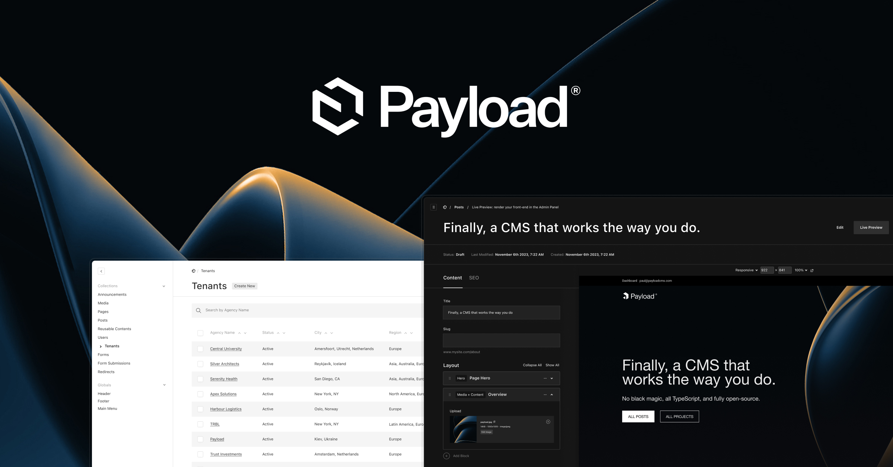

# Documentación: Next.js + Payload CMS

Bienvenido a la documentación oficial del proyecto. Aquí encontrarás guías para:

- Entender la estructura base
- Implementar autenticación segura
- Crear y publicar contenido desde el frontend

Comienza por conocer la [estructura del proyecto](estructura.md).

